# SmartCRM Pro - System Architecture

## Table of Contents
- [Overview](#overview)
- [Technology Stack](#technology-stack)
- [System Architecture](#system-architecture)
- [Database Design](#database-design)
- [Authentication Flow](#authentication-flow)
- [Lead Management Workflow](#lead-management-workflow)
- [Real-time Communication](#real-time-communication)
- [Deployment Architecture](#deployment-architecture)
- [Security Architecture](#security-architecture)
- [Scalability Considerations](#scalability-considerations)

---

## Overview

SmartCRM Pro is a modern, full-stack Customer Relationship Management system designed for gyms and fitness businesses. The application follows a three-tier architecture with a React frontend, Node.js/Express backend, and Supabase PostgreSQL database.

### Key Architectural Principles
- **Separation of Concerns**: Clear boundaries between presentation, business logic, and data layers
- **RESTful API Design**: Standard HTTP methods and status codes
- **Real-time Updates**: WebSocket integration for live notifications
- **Microservices Ready**: Modular service architecture for future scaling
- **Cloud-Native**: Containerized deployment on Render with Supabase backend

---

## Technology Stack

### Frontend Stack
```
┌─────────────────────────────────────┐
│     React 18 (TypeScript)           │
│  ┌─────────┬─────────┬───────────┐  │
│  │ Redux   │ React   │ Tailwind  │  │
│  │ Toolkit │ Router  │ CSS       │  │
│  └─────────┴─────────┴───────────┘  │
│  ┌─────────┬─────────┬───────────┐  │
│  │Chart.js │Socket.io│ Lucide    │  │
│  │         │ Client  │ React     │  │
│  └─────────┴─────────┴───────────┘  │
└─────────────────────────────────────┘
```

### Backend Stack
```
┌─────────────────────────────────────┐
│    Node.js 18 + Express.js          │
│  ┌─────────┬─────────┬───────────┐  │
│  │ Prisma  │Socket.io│ Winston   │  │
│  │ ORM     │ Server  │ Logger    │  │
│  └─────────┴─────────┴───────────┘  │
│  ┌─────────┬─────────┬───────────┐  │
│  │  JWT    │  Zod    │  Axios    │  │
│  │  Auth   │Validation│  HTTP    │  │
│  └─────────┴─────────┴───────────┘  │
└─────────────────────────────────────┘
```

### Infrastructure Stack
```
┌─────────────────────────────────────┐
│         Supabase Platform           │
│  ┌─────────┬─────────┬───────────┐  │
│  │PostgreSQL│  Auth   │  Email    │  │
│  │ Database │ Service │ Service   │  │
│  └─────────┴─────────┴───────────┘  │
│  ┌─────────┬─────────┬───────────┐  │
│  │ Storage │Real-time│   Edge    │  │
│  │         │ DB      │ Functions │  │
│  └─────────┴─────────┴───────────┘  │
└─────────────────────────────────────┘

┌─────────────────────────────────────┐
│      Render Deployment              │
│  ┌─────────────────────────────┐    │
│  │   Web Service (Frontend)    │    │
│  │   Static Site / Nginx       │    │
│  └─────────────────────────────┘    │
│  ┌─────────────────────────────┐    │
│  │   Web Service (Backend)     │    │
│  │   Node.js API Server        │    │
│  └─────────────────────────────┘    │
└─────────────────────────────────────┘
```

---

## System Architecture

### High-Level Architecture Diagram

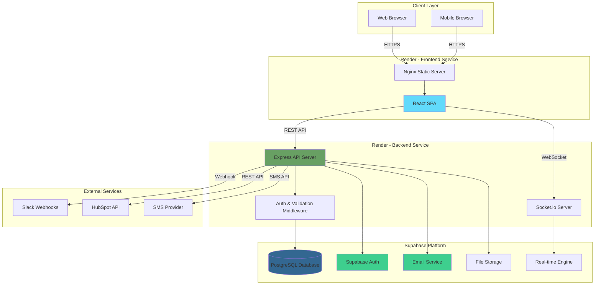
```mermaid
graph TB
    subgraph "Client Layer"
        WEB[Web Browser]
        MOBILE[Mobile Browser]
    end
    
    subgraph "Render - Frontend Service"
        NGINX[Nginx Static Server]
        REACT[React SPA]
    end
    
    subgraph "Render - Backend Service"
        API[Express API Server]
        SOCKET[Socket.io Server]
        MIDDLEWARE[Auth & Validation Middleware]
    end
    
    subgraph "Supabase Platform"
        DB[(PostgreSQL Database)]
        AUTH[Supabase Auth]
        EMAIL[Email Service]
        STORAGE[File Storage]
        REALTIME[Real-time Engine]
    end
    
    subgraph "External Services"
        SLACK[Slack Webhooks]
        HUBSPOT[HubSpot API]
        SMS[SMS Provider]
    end
    
    WEB -->|HTTPS| NGINX
    MOBILE -->|HTTPS| NGINX
    NGINX --> REACT
    REACT -->|REST API| API
    REACT -->|WebSocket| SOCKET
    
    API --> MIDDLEWARE
    MIDDLEWARE --> DB
    API --> AUTH
    API --> EMAIL
    API --> STORAGE
    SOCKET --> REALTIME
    
    API -->|Webhook| SLACK
    API -->|REST API| HUBSPOT
    API -->|SMS API| SMS
    
    style REACT fill:#61dafb
    style API fill:#68a063
    style DB fill:#336791
    style AUTH fill:#3ecf8e
    style EMAIL fill:#3ecf8e
```

### Three-Tier Architecture

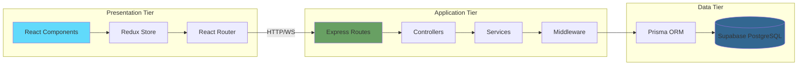
```mermaid
graph LR
    subgraph "Presentation Tier"
        A[React Components]
        B[Redux Store]
        C[React Router]
    end
    
    subgraph "Application Tier"
        D[Express Routes]
        E[Controllers]
        F[Services]
        G[Middleware]
    end
    
    subgraph "Data Tier"
        H[Prisma ORM]
        I[(Supabase PostgreSQL)]
    end
    
    A --> B
    B --> C
    C -->|HTTP/WS| D
    D --> E
    E --> F
    F --> G
    G --> H
    H --> I
    
    style A fill:#61dafb
    style D fill:#68a063
    style I fill:#336791
```

---

## Database Design

### Entity Relationship Diagram

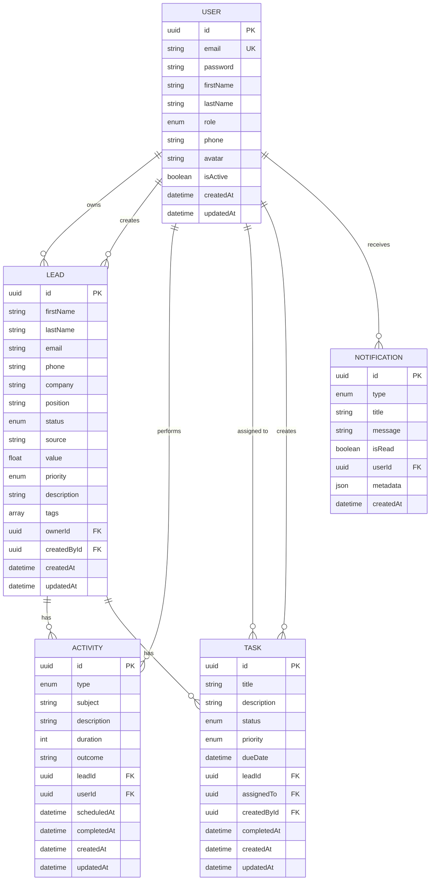
```mermaid
erDiagram
    USER ||--o{ LEAD : owns
    USER ||--o{ LEAD : creates
    USER ||--o{ ACTIVITY : performs
    USER ||--o{ TASK : "assigned to"
    USER ||--o{ TASK : creates
    USER ||--o{ NOTIFICATION : receives
    
    LEAD ||--o{ ACTIVITY : has
    LEAD ||--o{ TASK : has
    
    USER {
        uuid id PK
        string email UK
        string password
        string firstName
        string lastName
        enum role
        string phone
        string avatar
        boolean isActive
        datetime createdAt
        datetime updatedAt
    }
    
    LEAD {
        uuid id PK
        string firstName
        string lastName
        string email
        string phone
        string company
        string position
        enum status
        string source
        float value
        enum priority
        string description
        array tags
        uuid ownerId FK
        uuid createdById FK
        datetime createdAt
        datetime updatedAt
    }
    
    ACTIVITY {
        uuid id PK
        enum type
        string subject
        string description
        int duration
        string outcome
        uuid leadId FK
        uuid userId FK
        datetime scheduledAt
        datetime completedAt
        datetime createdAt
        datetime updatedAt
    }
    
    TASK {
        uuid id PK
        string title
        string description
        enum status
        enum priority
        datetime dueDate
        uuid leadId FK
        uuid assignedTo FK
        uuid createdById FK
        datetime completedAt
        datetime createdAt
        datetime updatedAt
    }
    
    NOTIFICATION {
        uuid id PK
        enum type
        string title
        string message
        boolean isRead
        uuid userId FK
        json metadata
        datetime createdAt
    }
```

### Database Schema Details

#### Enumerations

```typescript
enum Role {
  ADMIN           // Full system access
  MANAGER         // Team and lead management
  SALES_EXECUTIVE // Lead and task management
}

enum LeadStatus {
  NEW         // Initial contact
  CONTACTED   // First outreach made
  QUALIFIED   // Meets criteria
  PROPOSAL    // Proposal sent
  NEGOTIATION // In discussion
  WON         // Successfully closed
  LOST        // Opportunity lost
  ARCHIVED    // Inactive
}

enum Priority {
  LOW    // Nice to have
  MEDIUM // Standard priority
  HIGH   // Important
  URGENT // Immediate attention
}

enum ActivityType {
  NOTE          // General note
  CALL          // Phone call
  EMAIL         // Email communication
  MEETING       // In-person/virtual meeting
  TASK          // Task completion
  STATUS_CHANGE // Lead status update
}

enum TaskStatus {
  TODO        // Not started
  IN_PROGRESS // Currently working
  COMPLETED   // Finished
  CANCELLED   // Abandoned
}

enum NotificationType {
  LEAD_ASSIGNED       // New lead assignment
  TASK_ASSIGNED       // New task assignment
  TASK_DUE           // Task deadline approaching
  LEAD_STATUS_CHANGED // Lead status update
  ACTIVITY_REMINDER   // Scheduled activity reminder
  SYSTEM             // System notification
}
```

#### Indexes and Performance

```sql
-- User indexes
CREATE INDEX idx_users_email ON users(email);
CREATE INDEX idx_users_role ON users(role);

-- Lead indexes
CREATE INDEX idx_leads_email ON leads(email);
CREATE INDEX idx_leads_owner ON leads(ownerId);
CREATE INDEX idx_leads_status ON leads(status);
CREATE INDEX idx_leads_created ON leads(createdAt);

-- Activity indexes
CREATE INDEX idx_activities_lead ON activities(leadId);
CREATE INDEX idx_activities_user ON activities(userId);
CREATE INDEX idx_activities_type ON activities(type);
CREATE INDEX idx_activities_scheduled ON activities(scheduledAt);

-- Task indexes
CREATE INDEX idx_tasks_assigned ON tasks(assignedTo);
CREATE INDEX idx_tasks_status ON tasks(status);
CREATE INDEX idx_tasks_due ON tasks(dueDate);

-- Notification indexes
CREATE INDEX idx_notifications_user ON notifications(userId);
CREATE INDEX idx_notifications_read ON notifications(isRead);
CREATE INDEX idx_notifications_created ON notifications(createdAt);
```

---

## Authentication Flow

### JWT Authentication Workflow

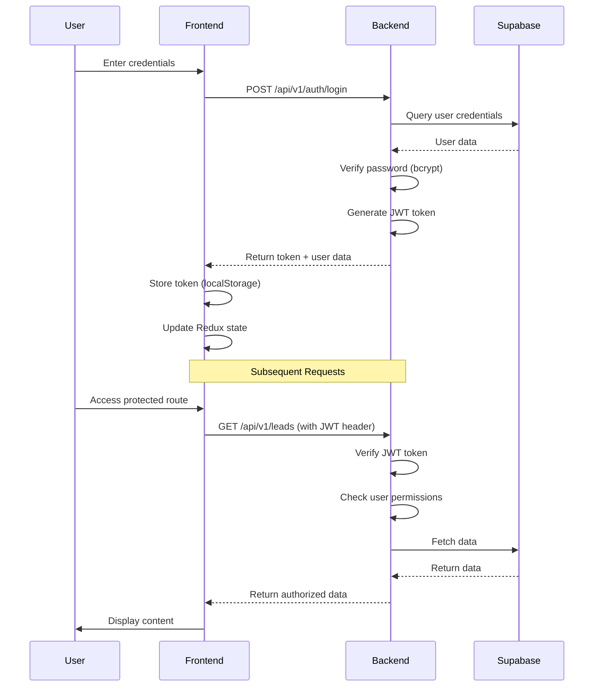
```mermaid
sequenceDiagram
    participant User
    participant Frontend
    participant Backend
    participant Supabase
    
    User->>Frontend: Enter credentials
    Frontend->>Backend: POST /api/v1/auth/login
    Backend->>Supabase: Query user credentials
    Supabase-->>Backend: User data
    Backend->>Backend: Verify password (bcrypt)
    Backend->>Backend: Generate JWT token
    Backend-->>Frontend: Return token + user data
    Frontend->>Frontend: Store token (localStorage)
    Frontend->>Frontend: Update Redux state
    
    Note over Frontend,Backend: Subsequent Requests
    
    User->>Frontend: Access protected route
    Frontend->>Backend: GET /api/v1/leads (with JWT header)
    Backend->>Backend: Verify JWT token
    Backend->>Backend: Check user permissions
    Backend->>Supabase: Fetch data
    Supabase-->>Backend: Return data
    Backend-->>Frontend: Return authorized data
    Frontend->>User: Display content
```

### Role-Based Access Control (RBAC)

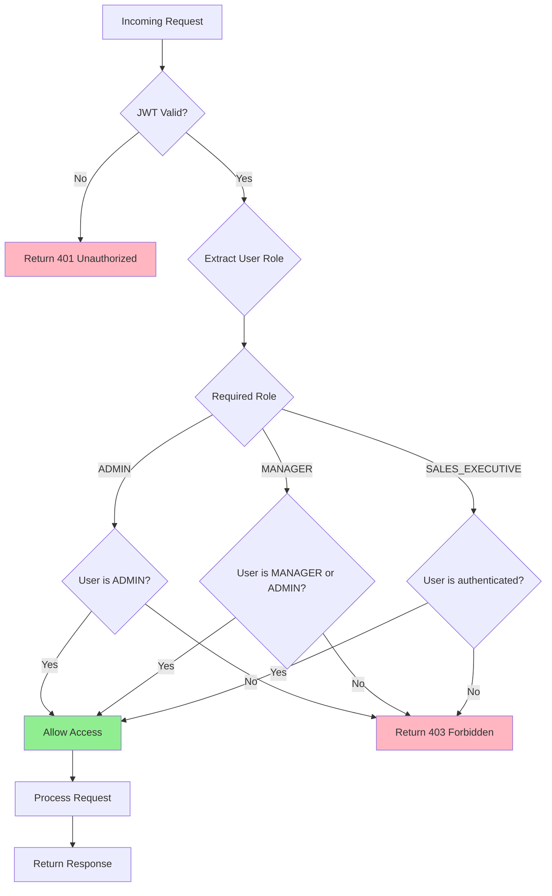
```mermaid
graph TD
    A[Incoming Request] --> B{JWT Valid?}
    B -->|No| C[Return 401 Unauthorized]
    B -->|Yes| D{Extract User Role}
    
    D --> E{Required Role}
    E -->|ADMIN| F{User is ADMIN?}
    E -->|MANAGER| G{User is MANAGER or ADMIN?}
    E -->|SALES_EXECUTIVE| H{User is authenticated?}
    
    F -->|Yes| I[Allow Access]
    F -->|No| J[Return 403 Forbidden]
    
    G -->|Yes| I
    G -->|No| J
    
    H -->|Yes| I
    H -->|No| J
    
    I --> K[Process Request]
    K --> L[Return Response]
    
    style I fill:#90EE90
    style J fill:#FFB6C1
    style C fill:#FFB6C1
```

---

## Lead Management Workflow

### Lead Lifecycle State Machine

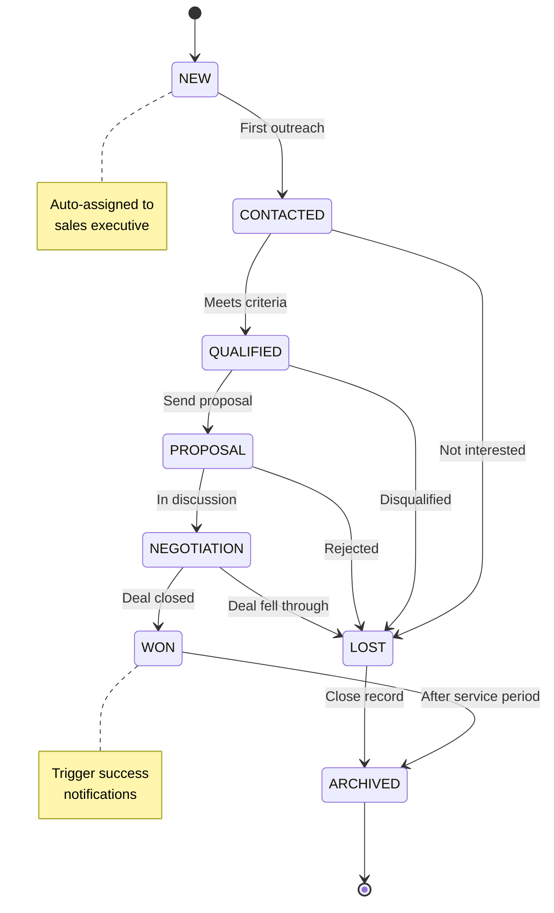
```mermaid
stateDiagram-v2
    [*] --> NEW
    NEW --> CONTACTED: First outreach
    CONTACTED --> QUALIFIED: Meets criteria
    CONTACTED --> LOST: Not interested
    
    QUALIFIED --> PROPOSAL: Send proposal
    QUALIFIED --> LOST: Disqualified
    
    PROPOSAL --> NEGOTIATION: In discussion
    PROPOSAL --> LOST: Rejected
    
    NEGOTIATION --> WON: Deal closed
    NEGOTIATION --> LOST: Deal fell through
    
    WON --> ARCHIVED: After service period
    LOST --> ARCHIVED: Close record
    
    ARCHIVED --> [*]
    
    note right of NEW
        Auto-assigned to
        sales executive
    end note
    
    note right of WON
        Trigger success
        notifications
    end note
```

### Lead Creation & Assignment Flow

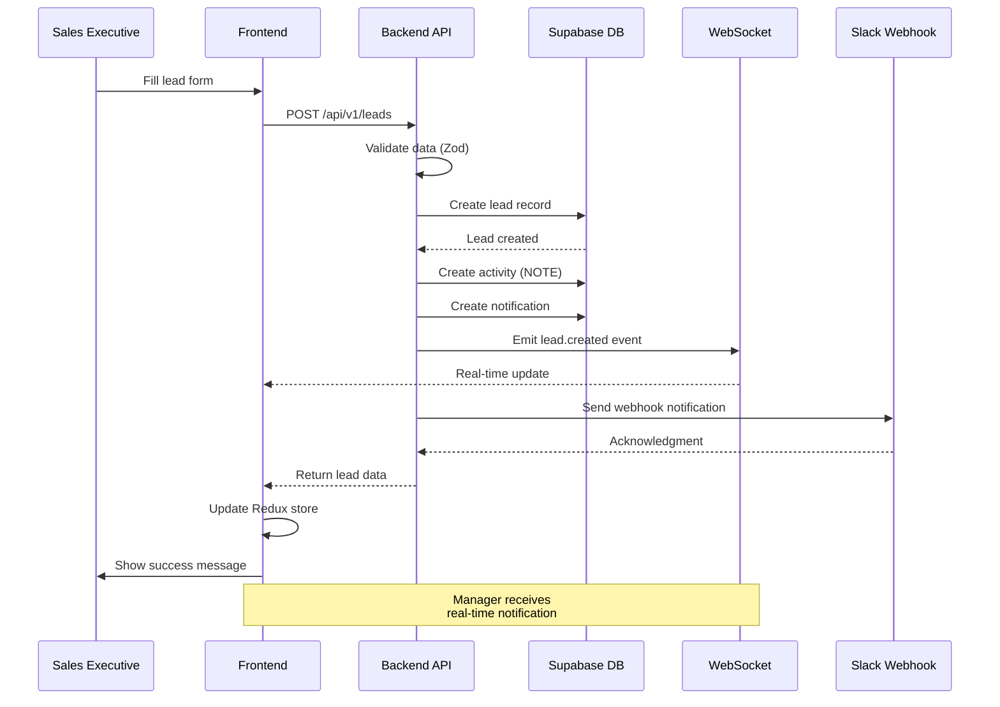
```mermaid
sequenceDiagram
    participant SE as Sales Executive
    participant FE as Frontend
    participant API as Backend API
    participant DB as Supabase DB
    participant WS as WebSocket
    participant Slack as Slack Webhook
    
    SE->>FE: Fill lead form
    FE->>API: POST /api/v1/leads
    API->>API: Validate data (Zod)
    API->>DB: Create lead record
    DB-->>API: Lead created
    
    API->>DB: Create activity (NOTE)
    API->>DB: Create notification
    
    API->>WS: Emit lead.created event
    WS-->>FE: Real-time update
    
    API->>Slack: Send webhook notification
    Slack-->>API: Acknowledgment
    
    API-->>FE: Return lead data
    FE->>FE: Update Redux store
    FE->>SE: Show success message
    
    Note over FE,WS: Manager receives<br/>real-time notification
```

---

## Real-time Communication

### WebSocket Architecture

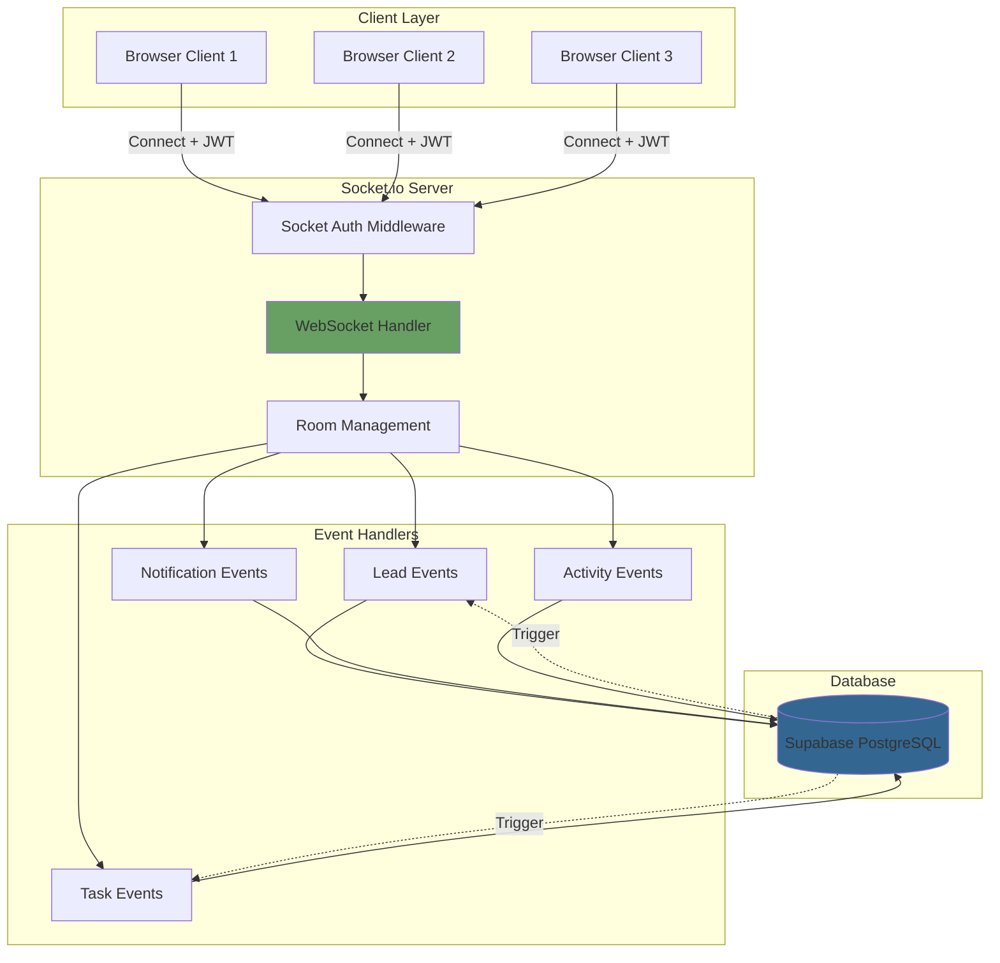
```mermaid
graph TB
    subgraph "Client Layer"
        C1[Browser Client 1]
        C2[Browser Client 2]
        C3[Browser Client 3]
    end
    
    subgraph "Socket.io Server"
        WS[WebSocket Handler]
        AUTH[Socket Auth Middleware]
        ROOMS[Room Management]
    end
    
    subgraph "Event Handlers"
        LEAD[Lead Events]
        TASK[Task Events]
        NOTIF[Notification Events]
        ACTIVITY[Activity Events]
    end
    
    subgraph "Database"
        DB[(Supabase PostgreSQL)]
    end
    
    C1 -->|Connect + JWT| AUTH
    C2 -->|Connect + JWT| AUTH
    C3 -->|Connect + JWT| AUTH
    
    AUTH --> WS
    WS --> ROOMS
    
    ROOMS --> LEAD
    ROOMS --> TASK
    ROOMS --> NOTIF
    ROOMS --> ACTIVITY
    
    LEAD --> DB
    TASK --> DB
    NOTIF --> DB
    ACTIVITY --> DB
    
    DB -.->|Trigger| LEAD
    DB -.->|Trigger| TASK
    
    style WS fill:#68a063
    style DB fill:#336791
```

### Event Types

```typescript
// Client -> Server Events
interface ClientEvents {
  'lead:subscribe': (leadId: string) => void;
  'lead:unsubscribe': (leadId: string) => void;
  'user:typing': (data: TypingData) => void;
}

// Server -> Client Events
interface ServerEvents {
  'lead:created': (lead: Lead) => void;
  'lead:updated': (lead: Lead) => void;
  'task:assigned': (task: Task) => void;
  'notification:new': (notification: Notification) => void;
  'activity:added': (activity: Activity) => void;
}
```

---

## Deployment Architecture

### Render Deployment Strategy

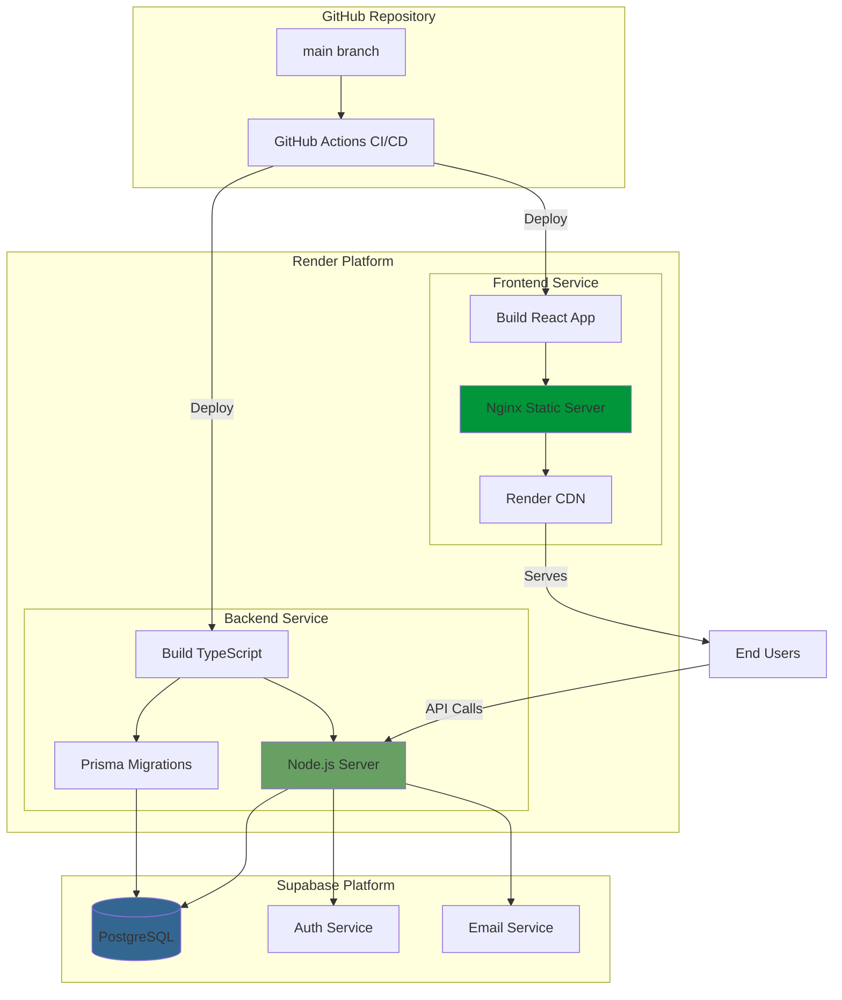
```mermaid
graph TB
    subgraph "GitHub Repository"
        MAIN[main branch]
        ACTIONS[GitHub Actions CI/CD]
    end
    
    subgraph "Render Platform"
        subgraph "Frontend Service"
            BUILD_FE[Build React App]
            NGINX_FE[Nginx Static Server]
            CDN[Render CDN]
        end
        
        subgraph "Backend Service"
            BUILD_BE[Build TypeScript]
            NODE_BE[Node.js Server]
            PRISMA[Prisma Migrations]
        end
    end
    
    subgraph "Supabase Platform"
        POSTGRES[(PostgreSQL)]
        AUTH_SVC[Auth Service]
        EMAIL_SVC[Email Service]
    end
    
    MAIN --> ACTIONS
    ACTIONS -->|Deploy| BUILD_FE
    ACTIONS -->|Deploy| BUILD_BE
    
    BUILD_FE --> NGINX_FE
    NGINX_FE --> CDN
    
    BUILD_BE --> PRISMA
    PRISMA --> POSTGRES
    BUILD_BE --> NODE_BE
    
    NODE_BE --> POSTGRES
    NODE_BE --> AUTH_SVC
    NODE_BE --> EMAIL_SVC
    
    CDN -->|Serves| CLIENT[End Users]
    CLIENT -->|API Calls| NODE_BE
    
    style POSTGRES fill:#336791
    style NODE_BE fill:#68a063
    style NGINX_FE fill:#009639
```

### Environment Configuration

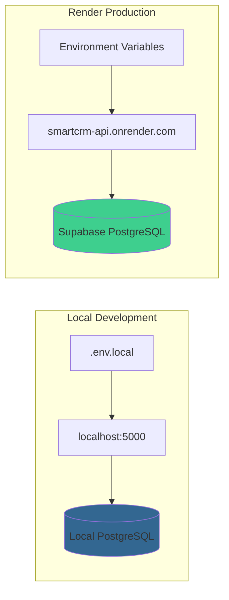
```mermaid
graph LR
    subgraph "Local Development"
        DEV_ENV[.env.local]
        DEV_DB[(Local PostgreSQL)]
        DEV_SERVER[localhost:5000]
    end
    
    subgraph "Render Production"
        PROD_ENV[Environment Variables]
        PROD_DB[(Supabase PostgreSQL)]
        PROD_SERVER[smartcrm-api.onrender.com]
    end
    
    DEV_ENV --> DEV_SERVER
    DEV_SERVER --> DEV_DB
    
    PROD_ENV --> PROD_SERVER
    PROD_SERVER --> PROD_DB
    
    style PROD_DB fill:#3ecf8e
    style DEV_DB fill:#336791
```

### Deployment Pipeline

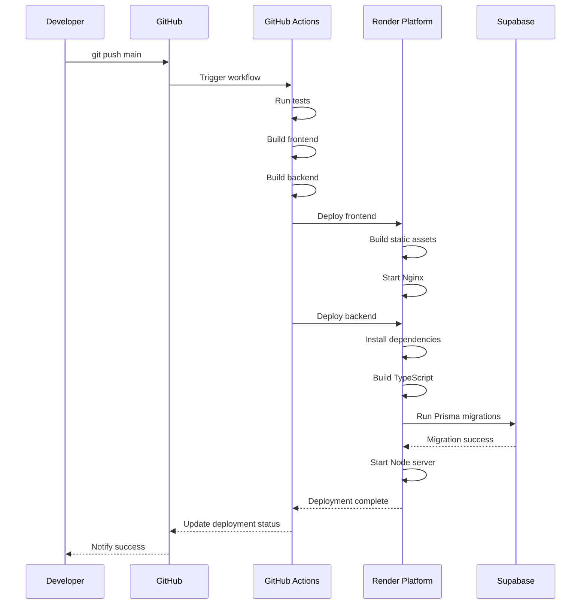
```mermaid
sequenceDiagram
    participant Dev as Developer
    participant Git as GitHub
    participant Actions as GitHub Actions
    participant Render as Render Platform
    participant Supa as Supabase
    
    Dev->>Git: git push main
    Git->>Actions: Trigger workflow
    
    Actions->>Actions: Run tests
    Actions->>Actions: Build frontend
    Actions->>Actions: Build backend
    
    Actions->>Render: Deploy frontend
    Render->>Render: Build static assets
    Render->>Render: Start Nginx
    
    Actions->>Render: Deploy backend
    Render->>Render: Install dependencies
    Render->>Render: Build TypeScript
    Render->>Supa: Run Prisma migrations
    Supa-->>Render: Migration success
    Render->>Render: Start Node server
    
    Render-->>Actions: Deployment complete
    Actions-->>Git: Update deployment status
    Git-->>Dev: Notify success
```

---

## Security Architecture

### Security Layers

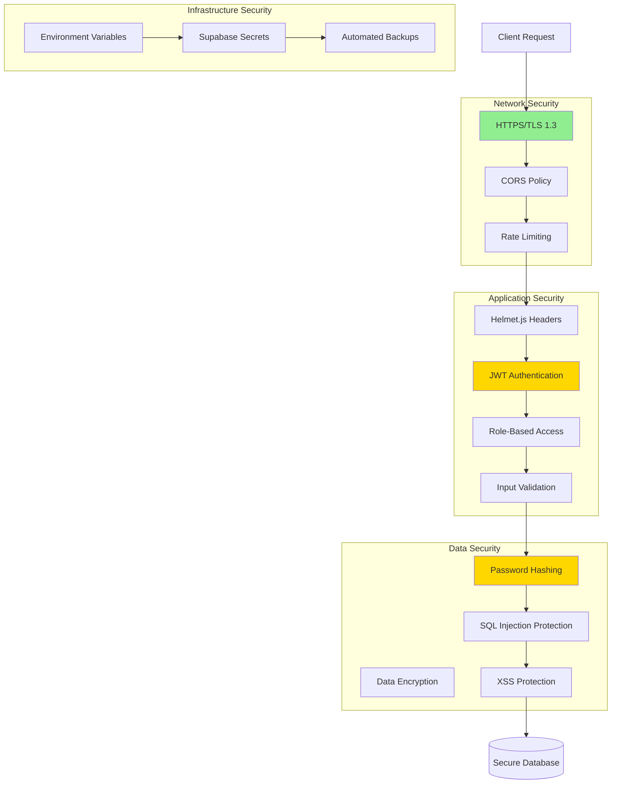
```mermaid
graph TB
    subgraph "Network Security"
        HTTPS[HTTPS/TLS 1.3]
        CORS[CORS Policy]
        RATE[Rate Limiting]
    end
    
    subgraph "Application Security"
        HELMET[Helmet.js Headers]
        JWT[JWT Authentication]
        RBAC[Role-Based Access]
        VALIDATION[Input Validation]
    end
    
    subgraph "Data Security"
        BCRYPT[Password Hashing]
        ENCRYPTION[Data Encryption]
        SQL_SAFE[SQL Injection Protection]
        XSS[XSS Protection]
    end
    
    subgraph "Infrastructure Security"
        ENV[Environment Variables]
        SECRETS[Supabase Secrets]
        BACKUP[Automated Backups]
    end
    
    CLIENT[Client Request] --> HTTPS
    HTTPS --> CORS
    CORS --> RATE
    RATE --> HELMET
    HELMET --> JWT
    JWT --> RBAC
    RBAC --> VALIDATION
    VALIDATION --> BCRYPT
    BCRYPT --> SQL_SAFE
    SQL_SAFE --> XSS
    XSS --> DATABASE[(Secure Database)]
    
    ENV --> SECRETS
    SECRETS --> BACKUP
    
    style JWT fill:#FFD700
    style BCRYPT fill:#FFD700
    style HTTPS fill:#90EE90
```

### Authentication Security Flow

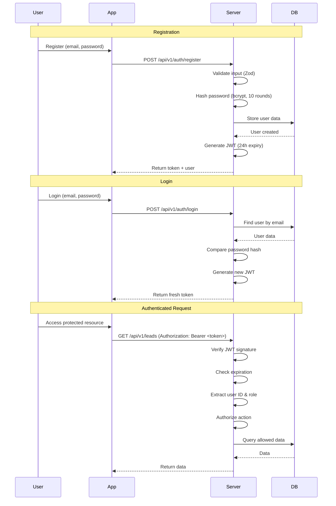
```mermaid
sequenceDiagram
    participant User
    participant App
    participant Server
    participant DB
    
    Note over User,DB: Registration
    User->>App: Register (email, password)
    App->>Server: POST /api/v1/auth/register
    Server->>Server: Validate input (Zod)
    Server->>Server: Hash password (bcrypt, 10 rounds)
    Server->>DB: Store user data
    DB-->>Server: User created
    Server->>Server: Generate JWT (24h expiry)
    Server-->>App: Return token + user
    
    Note over User,DB: Login
    User->>App: Login (email, password)
    App->>Server: POST /api/v1/auth/login
    Server->>DB: Find user by email
    DB-->>Server: User data
    Server->>Server: Compare password hash
    Server->>Server: Generate new JWT
    Server-->>App: Return fresh token
    
    Note over User,DB: Authenticated Request
    User->>App: Access protected resource
    App->>Server: GET /api/v1/leads (Authorization: Bearer <token>)
    Server->>Server: Verify JWT signature
    Server->>Server: Check expiration
    Server->>Server: Extract user ID & role
    Server->>Server: Authorize action
    Server->>DB: Query allowed data
    DB-->>Server: Data
    Server-->>App: Return data
```

---

## Scalability Considerations

### Horizontal Scaling Strategy

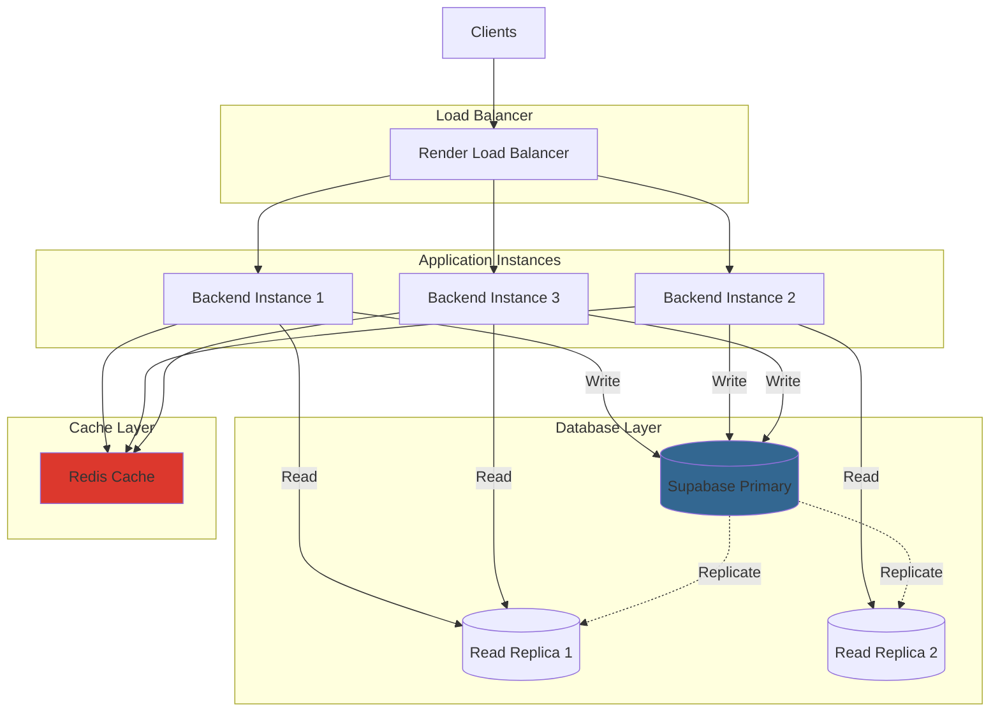
```mermaid
graph TB
    subgraph "Load Balancer"
        LB[Render Load Balancer]
    end
    
    subgraph "Application Instances"
        API1[Backend Instance 1]
        API2[Backend Instance 2]
        API3[Backend Instance 3]
    end
    
    subgraph "Database Layer"
        PRIMARY[(Supabase Primary)]
        REPLICA1[(Read Replica 1)]
        REPLICA2[(Read Replica 2)]
    end
    
    subgraph "Cache Layer"
        REDIS[Redis Cache]
    end
    
    CLIENT[Clients] --> LB
    LB --> API1
    LB --> API2
    LB --> API3
    
    API1 --> REDIS
    API2 --> REDIS
    API3 --> REDIS
    
    API1 -->|Write| PRIMARY
    API2 -->|Write| PRIMARY
    API3 -->|Write| PRIMARY
    
    API1 -->|Read| REPLICA1
    API2 -->|Read| REPLICA2
    API3 -->|Read| REPLICA1
    
    PRIMARY -.->|Replicate| REPLICA1
    PRIMARY -.->|Replicate| REPLICA2
    
    style PRIMARY fill:#336791
    style REDIS fill:#DC382D
```

### Performance Optimization


```mermaid
graph LR
    subgraph "Frontend Optimizations"
        LAZY[Lazy Loading]
        MEMO[React.memo]
        CHUNK[Code Splitting]
        CDN_F[CDN Caching]
    end
    
    subgraph "Backend Optimizations"
        PAGINATION[Pagination]
        INDEXING[Database Indexes]
        CACHE[Response Caching]
        POOL[Connection Pooling]
    end
    
    subgraph "Database Optimizations"
        QUERY_OPT[Query Optimization]
        MATERIALIZED[Materialized Views]
        PARTITIONING[Table Partitioning]
    end
    
    USER[User] --> LAZY
    LAZY --> MEMO
    MEMO --> CHUNK
    CHUNK --> CDN_F
    
    CDN_F --> PAGINATION
    PAGINATION --> INDEXING
    INDEXING --> CACHE
    CACHE --> POOL
    
    POOL --> QUERY_OPT
    QUERY_OPT --> MATERIALIZED
    MATERIALIZED --> PARTITIONING
    
    style INDEXING fill:#90EE90
    style CACHE fill:#FFD700
```

---

## Integration Architecture

### Third-Party Integration Flow


```mermaid
graph TB
    subgraph "SmartCRM Backend"
        API[Express API]
        INTEGRATIONS[Integration Service]
        QUEUE[Message Queue]
    end
    
    subgraph "External Services"
        SLACK[Slack Webhooks]
        HUBSPOT[HubSpot CRM]
        TWILIO[Twilio SMS]
        SENDGRID[SendGrid Email]
    end
    
    subgraph "Webhook Receiver"
        WEBHOOK[Inbound Webhook Endpoint]
        VALIDATOR[Signature Validator]
        PROCESSOR[Event Processor]
    end
    
    API --> INTEGRATIONS
    INTEGRATIONS --> QUEUE
    
    QUEUE -->|Lead Created| SLACK
    QUEUE -->|Contact Sync| HUBSPOT
    QUEUE -->|Send SMS| TWILIO
    QUEUE -->|Send Email| SENDGRID
    
    EXTERNAL[External Systems] --> WEBHOOK
    WEBHOOK --> VALIDATOR
    VALIDATOR --> PROCESSOR
    PROCESSOR --> API
    
    style SLACK fill:#4A154B
    style HUBSPOT fill:#FF7A59
    style INTEGRATIONS fill:#68a063
```

---

## API Architecture

### RESTful API Structure

```
/api/v1
├── /auth
│   ├── POST   /register          # User registration
│   ├── POST   /login             # User authentication
│   ├── POST   /logout            # Logout (clear token)
│   └── GET    /me                # Get current user
│
├── /users
│   ├── GET    /users             # List users (Admin/Manager)
│   ├── GET    /users/:id         # Get user by ID
│   ├── PUT    /users/:id         # Update user
│   └── DELETE /users/:id         # Delete user (Admin)
│
├── /leads
│   ├── GET    /leads             # List leads (paginated)
│   ├── POST   /leads             # Create lead
│   ├── GET    /leads/:id         # Get lead details
│   ├── PUT    /leads/:id         # Update lead
│   ├── DELETE /leads/:id         # Delete lead
│   └── PATCH  /leads/:id/status  # Update lead status
│
├── /activities
│   ├── GET    /activities        # List activities
│   ├── POST   /activities        # Create activity
│   ├── GET    /activities/:id    # Get activity
│   └── PUT    /activities/:id    # Update activity
│
├── /tasks
│   ├── GET    /tasks             # List tasks
│   ├── POST   /tasks             # Create task
│   ├── GET    /tasks/:id         # Get task
│   ├── PUT    /tasks/:id         # Update task
│   └── PATCH  /tasks/:id/status  # Update task status
│
├── /notifications
│   ├── GET    /notifications     # Get user notifications
│   ├── PATCH  /notifications/:id/read  # Mark as read
│   └── DELETE /notifications/:id # Delete notification
│
├── /analytics
│   ├── GET    /analytics/dashboard    # Dashboard stats
│   ├── GET    /analytics/conversion   # Conversion funnel
│   └── GET    /analytics/performance  # Performance metrics
│
├── /integrations
│   ├── GET    /integrations/status    # Integration status
│   ├── POST   /integrations/slack/test # Test Slack webhook
│   └── POST   /integrations/webhook/inbound # Receive webhooks
│
└── /health
    ├── GET    /health            # Health check
    └── GET    /ready             # Readiness check
```

---

## Monitoring & Logging Architecture


```mermaid
graph TB
    subgraph "Application"
        APP[Express Server]
        WINSTON[Winston Logger]
    end
    
    subgraph "Log Aggregation"
        FILE[Log Files]
        CONSOLE[Console Output]
        HTTP[HTTP Transport]
    end
    
    subgraph "Monitoring Services"
        RENDER_LOGS[Render Logs]
        SENTRY[Sentry Error Tracking]
        ANALYTICS[Analytics Dashboard]
    end
    
    APP --> WINSTON
    WINSTON --> FILE
    WINSTON --> CONSOLE
    WINSTON --> HTTP
    
    FILE --> RENDER_LOGS
    CONSOLE --> RENDER_LOGS
    HTTP --> SENTRY
    
    RENDER_LOGS --> ANALYTICS
    SENTRY --> ANALYTICS
    
    style WINSTON fill:#68a063
    style SENTRY fill:#362D59
```

### Log Levels and Categories

```typescript
// Winston Log Levels
const levels = {
  error: 0,   // System errors, exceptions
  warn: 1,    // Warning conditions
  info: 2,    // Informational messages
  http: 3,    // HTTP request logging
  debug: 4    // Debug information
};

// Log Categories
enum LogCategory {
  AUTH = 'auth',           // Authentication events
  DATABASE = 'database',   // Database operations
  API = 'api',            // API requests/responses
  INTEGRATION = 'integration', // Third-party integrations
  WEBSOCKET = 'websocket', // Real-time events
  SECURITY = 'security'    // Security events
}
```

---

## Disaster Recovery & Backup

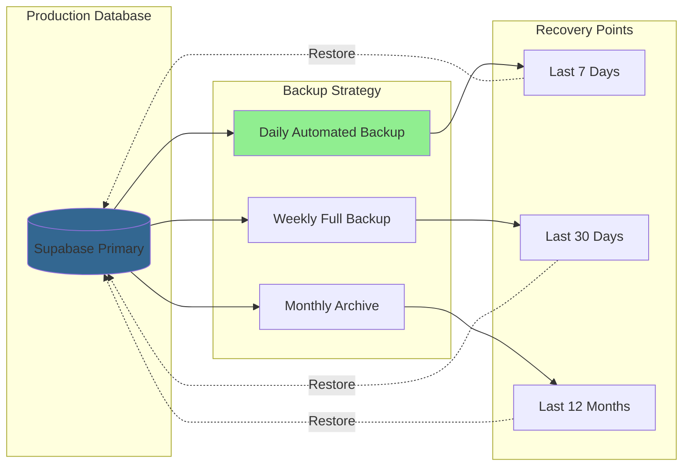
```mermaid
graph LR
    subgraph "Production Database"
        PRIMARY[(Supabase Primary)]
    end
    
    subgraph "Backup Strategy"
        DAILY[Daily Automated Backup]
        WEEKLY[Weekly Full Backup]
        MONTHLY[Monthly Archive]
    end
    
    subgraph "Recovery Points"
        POINT1[Last 7 Days]
        POINT2[Last 30 Days]
        POINT3[Last 12 Months]
    end
    
    PRIMARY --> DAILY
    PRIMARY --> WEEKLY
    PRIMARY --> MONTHLY
    
    DAILY --> POINT1
    WEEKLY --> POINT2
    MONTHLY --> POINT3
    
    POINT1 -.->|Restore| PRIMARY
    POINT2 -.->|Restore| PRIMARY
    POINT3 -.->|Restore| PRIMARY
    
    style PRIMARY fill:#336791
    style DAILY fill:#90EE90
```

---

## Future Enhancements

### Planned Architecture Evolution

1. **Microservices Migration**
   - Split monolith into domain services (Auth, Leads, Analytics)
   - Service mesh with API Gateway
   - Independent scaling per service

2. **Event-Driven Architecture**
   - Message broker (RabbitMQ/Kafka)
   - Event sourcing for audit trails
   - CQRS pattern for read/write optimization

3. **Enhanced Analytics**
   - Data warehouse integration
   - Real-time analytics pipeline
   - ML-based lead scoring

4. **Multi-tenancy Support**
   - Tenant isolation
   - Custom domains per tenant
   - Usage-based billing integration

5. **Mobile Applications**
   - React Native mobile apps
   - Offline-first architecture
   - Push notifications

---

## Conclusion

SmartCRM Pro's architecture is designed for:
- **Scalability**: Cloud-native deployment with Supabase and Render
- **Maintainability**: Clear separation of concerns and modular design
- **Security**: Multiple layers of protection for data and users
- **Performance**: Optimized queries, caching, and real-time updates
- **Extensibility**: Easy integration with third-party services

The system leverages modern technologies and best practices to deliver a robust, production-ready CRM solution for fitness businesses.
